<div align="center">

# Pit-Stop

*Drive in, get fixed, come out faster. You stay in the car.*

[](LICENSE)
[](https://github.com/Finn763/pit-stop/stargazers)
[](#repo-layout)

[中文](README.zh-CN.md) | English

</div>

> Review agents stop at findings. Pit-stop finishes the job.

Pit-stop is a cross-runtime agent skill: **one instruction runs a full improvement
loop — read → find → fix → verify → report — with no mid-run questions.**

```
Use pit-stop on <project path>
```

You say one line. The agent loads context, finds weaknesses (every one with
`path:line` evidence), fixes them in a review→fix loop, verifies with real tool
output, and returns once with a report split into verified / unverified /
remaining. Push and publish never happen without your explicit word.

---

## Why pit-stop exists

Built to fix three failure modes every agent owner has met:

- **#1: The agent reports, never fixes.** Reviews end with "you should…", and the
  diff never happens. **Fix:** the loop doesn't end at findings — fix, re-review
  (max 3 rounds, cross-round ledger, escalation on stagnation), then report.
- **#2: "Done" with no proof.** "Fixed!", "tests pass!" — with no command output
  behind the words. **Fix:** evidence before claims. No verification run in the
  turn = no success claim. Reports carry tool outputs, not adjectives.
- **#3: Improvement means bloat.** Suggestions pile on abstractions nobody asked for.
  **Fix:** every finding is tagged (`delete/stdlib/native/yagni/shrink/security/obs`),
  Speculative items are reported, never built. Nothing found: `Lean already. Ship.`

---

## How it runs



Five phases, one pass, zero mid-run questions — guardrails on top, escalation exit below.
[▶ Interactive version](https://finn763.github.io/pit-stop/architecture.html)

---

## Install (30 seconds)

```bash
npx skills add Finn763/pit-stop
```

Pick your agent when asked; update later with `npx skills update`. Per harness:

| Harness | Install |
|---|---|
| Claude Code | `/plugin marketplace add Finn763/pit-stop`, then `/plugin install pit-stop@pit-stop` |
| Codex | plugin from `.codex-plugin` (see repo), or `npx skills` above |
| Cursor | plugin from `.cursor-plugin`, or `/add-plugin pit-stop` |
| Gemini CLI | `gemini extensions install https://github.com/Finn763/pit-stop` |
| Pi | pi-package via `package.json`, or copy `skills/` |
| OpenCode | command + skill auto-discovered from `.opencode/` |
| Hermes | plugin from `.hermes-plugin`, or copy `skills/` |
| Anything else | `cp -r skills/pit-stop ~/.agents/skills/` |

No per-repo setup — there is nothing to configure.

---

## Philosophy

Evidence before claims · Review the fix, not the promise · Push waits for a human word ·
Cheap to run, honest about cost (phases report spend; one phase past $20 stops itself).

---

<details>
<summary><strong>Repo layout</strong></summary>

```
skills/pit-stop/SKILL.md          # the skill (<500-word core)
skills/pit-stop/references/       # phases, guardrails, verification
skills/pit-stop/templates/        # report template
hooks/block-destructive.sh        # L2 guardrail (Claude-family hooks)
commands/ .opencode/              # slash-command entries
.claude-plugin/ .codex-plugin/ .hermes-plugin/ .cursor/ .windsurf/
examples/before-after.md          # real run, real diff
docs/SPEC.md                      # full specification (v3)
```

</details>

MIT. Built by studying superpowers, mattpocock/skills, ponytail, Trail of Bits
skills, BugHunter, and code-review-graph — standing on their shoulders, see `docs/SPEC.md`.
