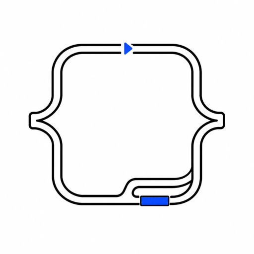

<div align="center">

<p align="center">
  <picture>
    <source media="(prefers-color-scheme: dark)" srcset="assets/logo-dark.png">
    
  </picture>
</p>

# Pit-Stop

*开进来，修好，出去更快。你不用下车。*

[](LICENSE)
[](https://github.com/Finn763/pit-stop/stargazers)
[]

[English](README.md) | 中文

</div>

> 评审 agent 停在"指出问题"。Pit-stop 把活干完。

别的 agent 工具都差一口气：PR 评审只读 PR；单文件评审 skill 只诊断不动手；阶段式技能
教流程却不端到端跑；架构类技能交份报告就走。Pit-stop 是陪你跑完全程的那个：
读、修、验、报，一句话，不用下车。

Pit-stop 是一个跨端 agent skill：**一句话跑完整个改进闭环——装载→找缺点→给建议→改→想点子→汇报，
中途不问你。**

```
用 pit-stop 改进 <项目路径>
```

你只说一句。agent 装载上下文，找缺点（每条带 `路径:行号` 证据），
修→复查循环里改完，用真实工具输出验证，最后一次性给报告
（分已验证/未验证/待定）。推送和发布永远要你亲口说才动手。

---

## 为什么做 pit-stop

为修三个每个 agent 用户都见过的毛病：

- **#1：只说不干。** 评审以"你应该……"结尾，diff 永远没来。**修法：** 循环不停在
  finding——改完复查（最多 3 轮，跨轮台账，不收敛升级），然后才汇报。
- **#2："好了"但没证据。** "修好了！"、"测试过了！"——背后没有一条命令输出。
  **修法：** 先证据后结论。本轮没跑验证命令，就不许说成功。报告里只放工具输出。
- **#3：越改越臃肿。** 建议全是没人要的抽象。**修法：** 每条发现打 tag
 （`delete/stdlib/native/yagni/shrink/perf/security/obs`），Speculative 只报不修。
  没活就直说：`Lean already. Ship.`。

> 一次真实战果：发现带 `文件:行号` 证据 8/8（手搓流程只有 5/8），两条口头"成功"被拦下、逼出工具回执。
> [看完整 before/after →](examples/before-after.md) 诚实基线：n=1 仓库，欢迎独立复跑。

---

## 运行环


六阶段一遍过，中途零打扰——护栏在上，升级出口在下。
[▶ 交互版](https://finn763.github.io/pit-stop/architecture.zh-CN.html)

1. **装载** — 读项目自己的说明 + `git status` + 最近提交热区，先写一行 MODE：什么算发现、什么直接拒。
2. **找缺点** — 先定范围再扫；每条发现带 `路径:行号` 证据、tag 和强度。
3. **给建议** — 只列 Strong 项：现象、证据、影响、最小修复、成本——另附"不做"清单。
4. **改** — 独立 reviewer 复查→再修的循环，最多 3 轮；不收敛升级给你。
5. **想点子** — 循环收口后只读头脑风暴：最多 3 条有锚点的 `[idea]` 候选，各带 kill-probe，本轮绝不实施。
6. **汇报** — 改了/验过（工具输出）/没验/剩下（idea 跟在 needs-human 项之后）；本轮没跑验证命令就不许说成功。

---

## 护栏

L2 hook（`hooks/block-destructive.sh`）跑在 Claude 系宿主里，fail-closed——解析不出的命令一律拦。喂它一条它认得出的破坏性命令，exit 2 并给出原因：

```
$ echo '{"tool_input":{"command":"rm -rf /"}}' | bash hooks/block-destructive.sh
BLOCKED by pit-stop: 'rm -rf /' matches file deletion (rm). Destructive ops need the human's explicit word.
$ echo $?
2
```

安全命令原样放行（`grep`、`man rm`、`git commit -m "... rm ..."`）。
覆盖命令位 `rm`（含 `sudo`/`do`/`command`/`env`/`nohup`/`time`/`xargs`/`\rm` 变体、
`sudo -u root rm` 这类带 flag 值、路径式 `/bin/rm`、多行命令后续行）、`find -exec rm`/`-delete`、
非 git VCS 强推、破坏性 git 子命令（`push`、`reset --hard`、`clean -f`、`branch -D`、
`checkout .`、`restore .`、`git rm`）。模式匹配是绊线不是沙箱——`sh -c 'rm …'` 这类向量留给
L1 禁令和 L3 终扫。90 例测试矩阵在 `hooks/test-block-destructive.sh`。

<details>
<summary><strong>安装（Claude Code——一个文件）</strong></summary>

```jsonc
// .claude/settings.json
{
  "hooks": {
    "PreToolUse": [
      { "matcher": "Bash", "hooks": [{ "type": "command", "command": "bash \"$CLAUDE_PROJECT_DIR/hooks/block-destructive.sh\"" }] }
    ]
  }
}
```

</details>

---

## 安装

```bash
npx skills add Finn763/pit-stop
```

两条路，同一个 skill：插件/registry 是订阅（更新自动来），拷 `skills/` 是拥有（文件归你、随你改）。

按提示选 agent，以后 `npx skills update` 更新。分端：

| 端 | 装法 |
|---|---|
| Claude Code | `/plugin marketplace add Finn763/pit-stop`，再 `/plugin install pit-stop@pit-stop` |
| Codex | `.codex-plugin` 插件，或上面 `npx skills` |
| Cursor | `.cursor/rules/` 规则（自动加载）；`.cursor-plugin/` 为 Cursor Plugins 格式清单 |
| Gemini CLI | `gemini extensions install https://github.com/Finn763/pit-stop` |
| Pi | `pi install npm:@finn763/pit-stop`（或拷 `skills/`） |
| OpenCode | `.opencode/command/` 命令入口，或拷 `skills/` |
| Hermes | `.hermes-plugin` 插件，或拷 `skills/` |
| Devin | `.devin-plugin/` 插件清单（见仓库）；兜底走下面最后一行 |
| Kimi | `.kimi-plugin/` 插件清单（见仓库）；兜底走下面最后一行 |
| Windsurf | `.windsurf/rules/` 规则 |
| 其他 | `cp -r skills/pit-stop ~/.agents/skills/` |

无需每仓配置——skill 本身零配置。hook 是唯一可选附加（按上面说明装到本仓）；别的没东西可配。

---

## pit-stop 钉死的东西

| 领域 | 钉死的内容 |
|---|---|
| 运行 | 六阶段一遍过：装载 → 找 → 给建议 → 改 → 想点子 → 汇报（验证是硬门，不算阶段）。中途零提问 |
| 发现 | 每条带 `路径:行号` 证据、tag 和强度——Speculative 只报不修 |
| 修复环 | 独立 reviewer 复查→再修，最多 3 轮，跨轮台账，不收敛升级给人 |
| 想点子 | 阶段 5 只读：≤3 条锚定本轮 ledger/diff 的 `[idea]` 候选，各带 kill-probe——本轮绝不实施 |
| 验证 | 本轮没跑验证命令就不许说成功。报告只放工具输出 |
| 花费 | 每阶段报花费，单阶段超 $20 自己停手 |
| 推送/发布 | 永不自动。一切改动留在工作区等你一句明确的话 |

---

<details>
<summary><strong>仓库结构</strong></summary>

```
skills/pit-stop/SKILL.md          # skill 本体（<500 词核心）
skills/pit-stop/references/       # 阶段规则（audit/fix/review/report/ideas）+ 护栏、验证
skills/pit-stop/templates/        # 报告模板
hooks/block-destructive.sh        # L2 护栏（Claude 系 hooks）
hooks/test-block-destructive.sh   # 90 例护栏矩阵（CI 三 OS）
hooks/check-consistency.sh        # 六阶段/[idea] 格式一致性门（CI）
commands/ .opencode/              # slash 命令入口
.claude-plugin/ .codex-plugin/ .cursor-plugin/ .devin-plugin/
.kimi-plugin/ .hermes-plugin/ .pi/ .cursor/ .windsurf/  # 各端适配
.claude/settings.json  .github/workflows/ci.yml  # 自挂 hook + CI 矩阵
gemini-extension.json  GEMINI.md  package.json
examples/before-after.md          # 真实战果
docs/SPEC.md                      # 完整 spec（v4）
```

</details>

## 参与贡献

本仓库施工规则在 [AGENTS.md](AGENTS.md)；欢迎修。

## 协议

[MIT](LICENSE)

*Lean already. Ship.*
